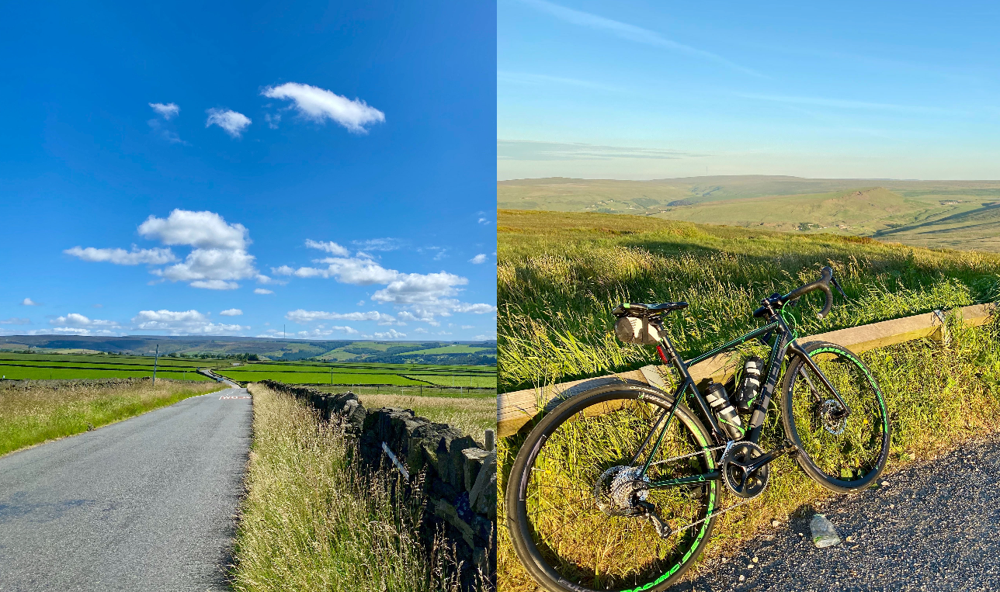

### Hi :wave:

My name is James Millner, and I'm currently located in [Huddersfield, West Yorkshire, UK](https://goo.gl/maps/b2JDpuxTTg5BFTe88) but have always lived in the Yorkshire area. 

### Fun Facts

- Unfortunately I'm not the legendary Liverpudlian footballer [James Milner](https://en.wikipedia.org/wiki/James_Milner) - although my mum will call me everytime I'm _"on the telly!"_

### Engineering Specific Notes

I'm a huge advocate of Kotlin. Its expressive and concise nature takes writing JVM-based applications to a whole new level, which makes it a current hobby language of choice.

Spring Boot is another resource I often lean on. It simplifies the process of setting up stand-alone applications, eliminating a lot of the fuss associated with boilerplate code and infrastructure.

I've also spent a good amount of time with Kafka, an event-streaming platform that's ideal for handling high-volume, real-time data. It's an integral part of the event-driven systems I work with, and lots of my professional experience
has interacted with it.

In addition to application development, I've frequently been involved with Containerisation and DevOps, not just professionally, but also as a personal hobby. 
This interest aligns with my fascination for System-on-Chip (SoC) computing. The concept of integrating all the components of a computer onto a single chip captivates me, and I may have a decent collection of Raspberry Pi's, much to the joy of my partner. 

Given the impressive power that these compact machines now possess, they offer an excellent platform for skill development. Check out [my blog post about Pi's](https://jamesmillner.dev/blog/2022/03/14/raspberry-pi-day/), but I find Kubernetes fascinating and challenging, so I've been trying to upskill on my own 
playground.

So, these are the bits of tech that get me up and coding in the morning!

### Experience

I'm currently working as an idle means no job . 

### Skills

A lot of my experience is predominantly around the backend Django , in Html-css & js. Below though is a list of tools and technologies that I have experience with:

#### Programming / Scripting Languages

C &bull; Python &bull; JavaScript &bull; Typescript &bull; React &bull;  Bash Scripting 

#### Frameworks

Django &bull; Tailwndcss &bull; rest Framework &bull;  

#### Operating Systems

MacOS &bull; Ubuntu &bull; Debian &bull; Windows, especially WSL

#### What do I want to learn next?

AWS &bull; GCloud &bull; Digital Ocean &bull; Terraform &bull; Cloudformation &bull; AWS CDK &bull; Chef &bull; Ansible 

#### Monitoring and Observability

Prometheus &bull; Grafana

#### Database Technologies

MySQL &bull; Postgres &bull; 

#### Other Tools

Kubernetes &bull; Docker &bull; Git &bull; Makefiles &bull; Intellij IDEA &bull; VSCode &bull; Atom